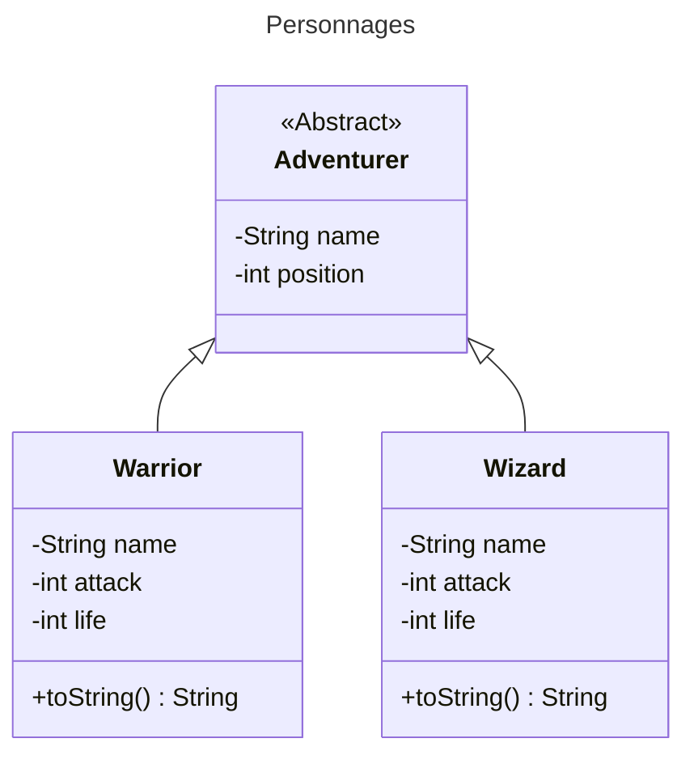
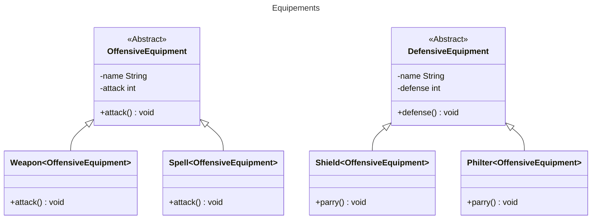

```mermaid
---
title: Personnages
---
classDiagram
    Adventurer <|-- Warrior
    Adventurer <|-- Wizard
    class Adventurer{
        <<Abstract>>
        -String name
        -int position
    }
    class Warrior~Adventurer~{
        -String name
        -int attack
        -int life
        +toString() String
    }
    class Wizard~Adventurer~{
        -String name
        -int attack
        -int life
        +toString() String
    }
    
```

```mermaid
---
title: Equipements
---
classDiagram
    OffensiveEquipment <|-- Weapon~OffensiveEquipment~
    OffensiveEquipment <|-- Spell~OffensiveEquipment~
    DefensiveEquipment <|-- Shield~OffensiveEquipment~
    DefensiveEquipment <|-- Philter~OffensiveEquipment~
    class OffensiveEquipment {
        <<Abstract>>
        -name String
        -attack int
        +attack() void
    }
    class Weapon~OffensiveEquipment~ {
        +attack() void
    }
    class Spell~OffensiveEquipment~ {
        +attack() void
    }
    class DefensiveEquipment {
        <<Abstract>>
        -name String
        -defense int
        +defense() void
    }
    class Shield~OffensiveEquipment~ {
        +parry() void
    }
    class Philter~OffensiveEquipment~ {
        +parry() void
    }
    
```

```mermaid
---
title: Menus
---
classDiagram
    Menu <|-- MainMenu~Menu~
    Menu <|-- StartMenu~Menu~
    Menu <|-- AddPlayerMenu~Menu~
    Menu <|-- GiveName
    Menu <|-- DisplayCharacterMenu~Menu~
    Menu <|-- ModifyCharacterMenu~Menu~
    Menu <|-- ModifyAttributeMenu~Menu~
    Menu <|-- ModifyTypeMenu~Menu~
    Menu <|-- ExitMenu~Menu~
    class Menu {
        <<Abstract>>
        +displayChoices() void
        #introMenu() void
        #isValidIntResponse(String) int
        #isValidStringResponse(String) String
        +getIntResponse() int
        +getStringResponse() String
    }
    class MainMenu~Menu~ {
        +displayChoices() void
        +start(ArrayList<Adventurer>) void
    }
    class StartMenu~Menu~ {
        +displayChoices() void
        +handleUserChoice(ArrayList<Adventurer>, int) ArrayList<Adventurer>
        -addPlayer(ArrayList<Adventurer>) ArrayList<Adventurer>
        -displayPlayers(ArrayList<Adventurer>) ArrayList<Adventurer>
        -startPlaying() void
        -endGame() void
        +possibleResponses
        <<Enumeration>>
    }
    class AddPlayerMenu~Menu~ {
        +displayChoices() void
        +handleUserChoice(ArrayList<Adventurer>, int) ArrayList<Adventurer>
        -createWarrior(ArrayList<Adventurer>, int) ArrayList<Adventurer>
        -createWizard(ArrayList<Adventurer>, int) ArrayList<Adventurer>
        -goBack() void
        -endGame() void
        +possibleResponses
        <<Enumeration>>
    }
    class GiveName~Menu~{
        +displayChoices() void
        +addName(Adventurer) Adventurer
    }
    class DisplayCharacterMenu~Menu~ {
        +displayChoices() void
        +displayPlayers(ArrayList<Adventurer>) void
        +handleUserChoice(ArrayList<Adventurer>, int) ArrayList<Adventurer>
        -goBack() void
        -endGame() void
        +possibleResponses
        <<Enumeration>>
    }
    class ModifyCharacterMenu~Menu~ {
        +displayChoices() void
        +handleUserChoice(ArrayList<Adventurer>, int) ArrayList<Adventurer>
    }
    class ModifyAttributeMenu~Menu~ {
        +displayChoices() void
        +handleUserChoice(ArrayList<Adventurer>, int) ArrayList<Adventurer>
        -modifyName(Adventurer) Adventurer
        -modifyType(Adventurer) Adventurer
        -goBack() void
        -endGame() void
        +possibleResponses
        <<Enumeration>>
    }
    class ModifyTypeMenu~Menu~ {
        +displayChoices() void
        +handleUserChoice(Adventurer, int) Adventurer
        -makeWarrior(Adventurer) Adventurer
        -makeWizard(Adventurer) Adventurer
        -goBack() void
        -endGame() void
        +possibleResponses
        <<Enumeration>>
    }
    class ExitMenu~Menu~ {
        +displayChoices() void
        +handleUserChoice(int) void
        -endGame() void
        -goBack() void
        +possibleResponses
        <<Enumeration>>
    }
```

```mermaid
---
title: Dungeons and dragons
---
classDiagram
    Adventurer <|-- Warrior~Adventurer~
    Adventurer <|-- Wizard~Adventurer~
    OffensiveEquipment <|-- Weapon~OffensiveEquipment~
    OffensiveEquipment <|-- Spell~OffensiveEquipment~
    DefensiveEquipment <|-- Shield~OffensiveEquipment~
    DefensiveEquipment <|-- Philter~OffensiveEquipment~
    Menu <|-- MainMenu~Menu~
    Menu <|-- StartMenu~Menu~
    Menu <|-- AddPlayerMenu~Menu~
    Menu <|-- GiveName~Menu~
    Menu <|-- DisplayCharacterMenu~Menu~
    Menu <|-- ModifyCharacterMenu~Menu~
    Menu <|-- ModifyAttributeMenu~Menu~
    Menu <|-- ModifyTypeMenu~Menu~
    Menu <|-- ExitMenu~Menu~

    class Game {
        +play(ArrayList<Adventurer>) boolean
        -newPosition(Adventurer, int) boolean
    }
    class Adventurer {
        <<Abstract>>
        -String name
        -int position
    }
    class Warrior~Adventurer~ {
        -String name
        -int attack
        -int life
        +toString() String
    }
    class Wizard~Adventurer~ {
        -String name
        -int attack
        -int life
        +toString() String
    }
    class OffensiveEquipment {
        <<Abstract>>
        -name String
        -attack int
        +attack() void
    }
    class Weapon~OffensiveEquipment~ {
        +attack() void
    }
    class Spell~OffensiveEquipment~ {
        +attack() void
    }
    class DefensiveEquipment {
        <<Abstract>>
        -name String
        -defense int
        +defense() void
    }
    class Shield~OffensiveEquipment~ {
        +parry() void
    }
    class Philter~OffensiveEquipment~ {
        +parry() void
    }
    class Menu {
        <<Abstract>>
        +displayChoices() void
        #introMenu() void
        #isValidIntResponse(String) int
        #isValidStringResponse(String) String
        +getIntResponse() int
        +getStringResponse() String
    }
    class MainMenu~Menu~ {
        +displayChoices() void
        +start(ArrayList<Adventurer>) void
    }
    class StartMenu~Menu~ {
        +displayChoices() void
        +handleUserChoice(ArrayList<Adventurer>, int) ArrayList<Adventurer>
        -addPlayer(ArrayList<Adventurer>) ArrayList<Adventurer>
        -displayPlayers(ArrayList<Adventurer>) ArrayList<Adventurer>
        -startPlaying() void
        -endGame() void
        +possibleResponses
        <<Enumeration>>
    }
    class AddPlayerMenu~Menu~ {
        +displayChoices() void
        +handleUserChoice(ArrayList<Adventurer>, int) ArrayList<Adventurer>
        -createWarrior(ArrayList<Adventurer>, int) ArrayList<Adventurer>
        -createWizard(ArrayList<Adventurer>, int) ArrayList<Adventurer>
        -goBack() void
        -endGame() void
        +possibleResponses
        <<Enumeration>>
    }
    class GiveName~Menu~ {
        +displayChoices() void
        +addName(Adventurer) Adventurer
    }
    class DisplayCharacterMenu~Menu~ {
        +displayChoices() void
        +displayPlayers(ArrayList<Adventurer>) void
        +handleUserChoice(ArrayList<Adventurer>, int) ArrayList<Adventurer>
        -goBack() void
        -endGame() void
        +possibleResponses
        <<Enumeration>>
    }
    class ModifyCharacterMenu~Menu~ {
        +displayChoices() void
        +handleUserChoice(ArrayList<Adventurer>, int) ArrayList<Adventurer>
    }
    class ModifyAttributeMenu~Menu~ {
        +displayChoices() void
        +handleUserChoice(ArrayList<Adventurer>, int) ArrayList<Adventurer>
        -modifyName(Adventurer) Adventurer
        -modifyType(Adventurer) Adventurer
        -goBack() void
        -endGame() void
        +possibleResponses
        <<Enumeration>>
    }
    class ModifyTypeMenu~Menu~ {
        +displayChoices() void
        +handleUserChoice(Adventurer, int) Adventurer
        -makeWarrior(Adventurer) Adventurer
        -makeWizard(Adventurer) Adventurer
        -goBack() void
        -endGame() void
        +possibleResponses
        <<Enumeration>>
    }
    class ExitMenu~Menu~ {
        +displayChoices() void
        +handleUserChoice(int) void
        -endGame() void
        -goBack() void
        +possibleResponses
        <<Enumeration>>
    }
```